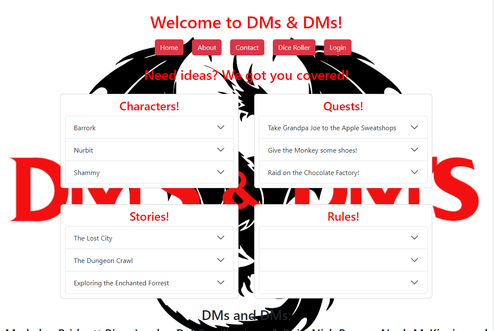
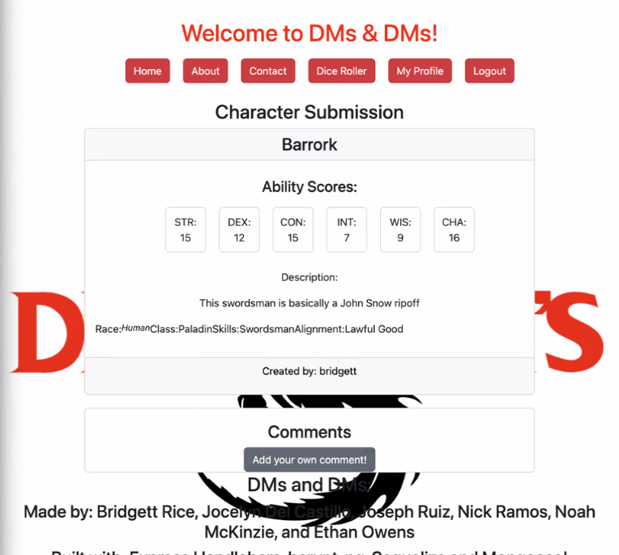
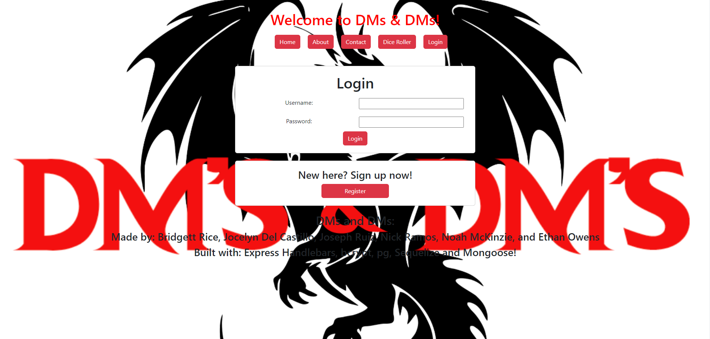

# DMs & DMs

## Table of Contents
* [Description](#description)
* [Installation](#installation)
* [Usage](#usage)
* [License](#license)
* [Contributing](#contributing)
* [Tests](#tests)
* [Questions](#questions)

## Description

DMs & DMs is a webpage designed to connect DMs with other DMs to share different ideas for characters, stories, quest, and homebrewed rules.

## Link to deployed application
 
Link to Deployed Page: https://dms-and-dms.onrender.com
Link to Github: https://github.com/Teacher2Coder/dms-and-dms

## Webpage Screenshot

Home Page

Character Page

Login Page

## Installation
Installation requires npm install which will install all dependencies within the package.json.
 
## Usage
Users can create their own personal accounts which will grant them access to all the different forums on the webpage. Once they are registered and logged in, they can go to different forums to share ideas and comment on other users ideas. 
 
## License

[MIT](https://choosealicense.com/licenses/mit/)
 
## Contributing
Code Created by Etan Owens, Jocelyn Del Castillo, Joseph Ruiz, Bridgett Rice, Noah Mckenzie, and Nick Ramos
 
## Tests
Test it
 
## Questions
* GitHub: [@teacher2coder](https://www.github.com/teacher2coder)
* Email: ethan.owens4@gmail.com